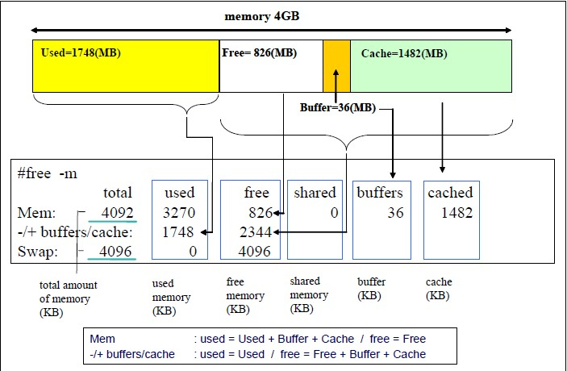

# ch4

```bash
linux:~ # free -h
               total        used        free      shared  buff/cache   available
Mem:            62Gi       3.9Gi        18Gi       168Mi        39Gi        57Gi
Swap:           32Gi       144Mi        32Gi
```

```txt
total
    total memory
    (MemTotal and SwapTotal in /proc/meminfo)

used
    used memory
    (used = total - free - buffers - cache)

free
    unused memory
    (MemFree and SwapFree in /proc/meminfo)

shared
    used memory (mostly) by tmpfs
    (Shmem in /proc/meminfo)

buffers
    used memory by kernel buffers
    (Buffers in /proc/meminfo)

cache
    used memory by the page cache and slabs
    (Cached and SReclaimable in /proc/meminfo)

buff/cache
    sum of buffers and cache
    (buffers + cache)

available
    estimation of how much memory is available for starting new applications, without swapping.
    (MemAvailable in /proc/meminfo, available on kernels 3.14)
```


